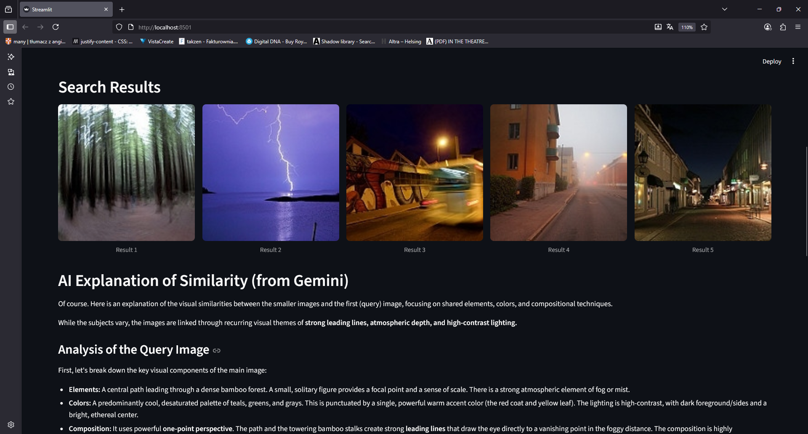

# High-Performance Visual Search Engine (FAISS & ResNet)

### A high-performance visual search engine that uses an Approximate K-Nearest Neighbors (ANN) algorithm with FAISS and ResNet embeddings to find similar images in a large dataset, with explanations from Gemini Pro.

    

## 🚀 Overview

This project demonstrates a senior-level approach to solving a classic machine learning problem at scale: **similarity search**. The application functions as a reverse image search engine. A user uploads an image, and the system rapidly searches a database of over 14,000 images to find the most visually similar results.

The core of this project is the use of an **Approximate Nearest Neighbors (ANN)** index, built with **Facebook AI's FAISS library**. This showcases an understanding of performance and scalability, moving beyond naive K-Nearest Neighbors to a solution capable of handling massive datasets with millisecond latency. The project is further enhanced with a Generative AI layer (Gemini 2.5 Pro) to provide natural language explanations for the search results.

## ✨ Key Features & Techniques

*   **High-Performance Similarity Search:** Implements a FAISS index (`IndexFlatL2`) to solve the performance bottleneck of traditional KNN, demonstrating a key skill for production-level ML systems.
*   **Deep Learning for Feature Extraction:** Uses a pre-trained **ResNet18** model (via **PyTorch**) to convert images into high-dimensional feature vectors (embeddings). This shows proficiency in transfer learning for computer vision.
*   **Two-Phase Architecture (Offline/Online):** The project is structured into two distinct phases:
    1.  **Offline Indexing (`indexer.py`):** A script that processes the entire dataset once to build and save the efficient FAISS index.
    2.  **Online Serving (`app.py`):** A lightweight Streamlit application that loads the pre-built index to perform near-instantaneous searches.
*   **Generative AI for Explainability (XAI):** Integrates **Google's Gemini 2.5 Pro** to add an explainability layer, using its multi-modal capabilities to analyze the query and result images and explain *why* they are considered similar.
*   **Scalable Design:** The architecture is designed to scale easily to millions of images by simply running the indexing script on a larger dataset.

## 🛠️ How to Run

1.  **Clone the repository:**
    ```bash
    git clone https://github.com/takzen/fast-visual-search-engine.git
    cd fast-visual-search-engine
    ```

2.  **Download the Dataset:**
    *   Download the "Intel Image Classification" dataset from [Kaggle](https://www.kaggle.com/datasets/puneet6060/intel-image-classification).
    *   Create a `data/` folder in the project root.
    *   Unzip and place the `seg_train/seg_train` directory inside `data/`. The final path to an image should look like `data/seg_train/buildings/0.jpg`.

3.  **Create a virtual environment and install dependencies:**
    ```bash
    uv venv
    source .venv/bin/activate
    uv pip install streamlit python-dotenv Pillow torch torchvision faiss-cpu google-generativeai
    ```

4.  **Set up your Google AI API Key:**
    *   Create a file named `.env` in the root of the project.
    *   Add your key: `GOOGLE_API_KEY="YOUR_API_KEY_HERE"`

5.  **Build the FAISS Index (Offline Step):**
    *   Run the indexing script from your terminal. This will take several minutes.
        ```bash
        python indexer.py
        ```
    *   This will create `image_index.faiss` and `image_paths.json` in your project root.

6.  **Run the Streamlit Application (Online Step):**
    ```bash
    streamlit run app.py
    ```

## 🖼️ Showcase

| 1. User Uploads a Query Image                           | 2. Instantaneous Search Results & AI Explanation             |
| :-------------------------------------------------------- | :----------------------------------------------------------- |
|                    |               |
| *The user uploads any image to find similar ones.*        | *The app uses FAISS to find the top 5 matches instantly and then uses Gemini to explain the visual similarities.* |